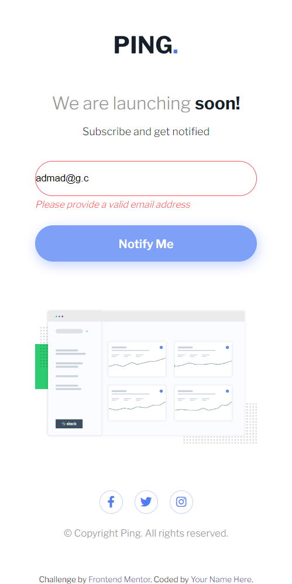
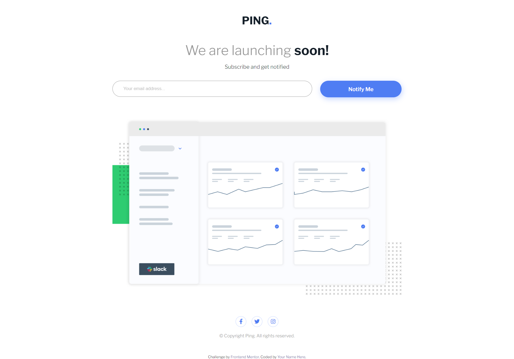

# Ping Coming Soon Page 👨‍💻

## Project Overview 🌟

This is a front-end coding challenge completed for [Frontend Mentor](https://www.frontendmentor.io). The challenge was to build a ping coming soon page master and make it look as close to the provided design as possible.

## Technologies Used 💻

- HTML
- CSS

### The Challenge 📋

Your challenge is to build out this Coming Soon page and get it looking as close to the design as possible.

Your users should be able to: 

- View the optimal layout for the site depending on their device's screen size
- See hover states for all interactive elements on the page
- Submit their email address using an `input` field
- Receive an error message when the `form` is submitted if:
	- The `input` field is empty. The message for this error should say *"Whoops! It looks like you forgot to add your email"*
	- The email address is not formatted correctly (i.e. a correct email address should have this structure: `name@host.tld`). The message for this error should say *"Please provide a valid email address"*

## Screenshots 📷

| Mobile                                            | Desktop                                            |
| ------------------------------------------------- | -------------------------------------------------- |
|             |               |

## Live Demo 🚀

You can view the live demo of the project [here](https://ping-coming-soon-page-js1.netlify.app/).